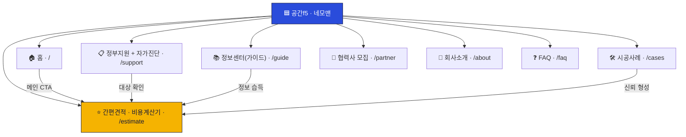
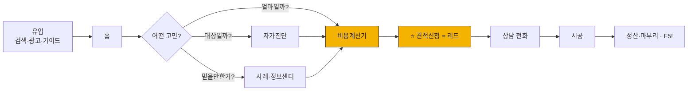
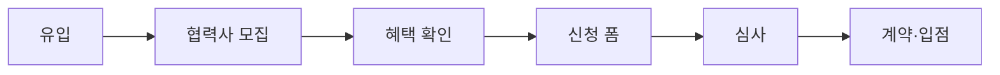

# 공간f5 · 네모맨 사이트맵 (v0.2)

| 항목 | 내용 |
|---|---|
| 문서 버전 | **v0.2** (레퍼런스 답습 → 자체 개선안) |
| 작성일 | 2026-07-22 |
| 관련 문서 | [기획서.md](기획서.md) · [작업계획.md](작업계획.md) · [디자인브리프.md](디자인브리프.md) |
| 레퍼런스 *(구조 참고·복제 금지)* | https://ez-house.kr (철거의고수) |

---

## 0. 개선 방향 한눈에

레퍼런스(철거의고수)는 **"콜드 견적 폼 1개"** 로 끝나는 단순 퍼널. 공간f5는 3가지를 더한다.

| 구분 | 레퍼런스 | 공간f5 · 네모맨 (개선) |
|---|---|---|
| 진입 | 견적 폼 하나 | **자가진단 + 비용계산기**로 문턱 낮추고 리드를 "데움" |
| 신뢰 | 후기·실적 의존 *(우린 초기 불가)* | **정보센터·투명 견적·정부 공식 연계·약속**으로 대체 |
| 유입 | 광고 의존 | **콘텐츠 SEO(가이드)** 추가 |
| 정체성 | 철거 매칭 | **공간 솔루션 브랜드**(F5 = 새로고침 서사) |
| 범위 | 철거 | 철거·원상복구·폐기물·**정부지원 대행**까지 |

---

## 1. 전체 구조



> ⭐ **간편견적(비용계산기+신청)** 이 모든 경로가 수렴하는 핵심 전환 지점.
> 자가진단·정보센터·사례는 그 앞에서 방문자를 "데우는" 장치.

---

## 2. 페이지 목록 & 우선순위

| # | 페이지 | 파일 | 역할 | 단계 |
|---|---|---|---|---|
| 1 | 홈 | `/index.html` | 브랜드 후킹 + 3대 진입로 | **MVP** |
| 2 | 정부지원 + 자가진단 | `/support.html` | 제도 설득 + 자격 필터 | **MVP** |
| 3 | 간편견적 · 비용계산기 ⭐ | `/estimate.html` | **핵심 전환**(계산기→신청) | **MVP** |
| 4 | 시공사례 | `/cases.html` | 사회적 증거 | **MVP** *(초기 "준비중")* |
| 5 | 협력사 모집 | `/partner.html` | 공급자(업체) 모집 | **MVP** |
| 6 | FAQ | `/faq.html` | 불안 해소 + SEO | **MVP** |
| 7 | 이용약관 / 개인정보처리방침 | `/terms`, `/privacy` | 법적 고지(폼 필수) | **MVP** |
| 8 | 정보센터(가이드) | `/guide/` | 콘텐츠 SEO·신뢰 | Phase 2 |
| 9 | 회사소개 | `/about.html` | 브랜드 스토리·신뢰 | Phase 2 *(초기엔 홈 섹션)* |

> **MVP는 린하게**, 서비스 소개·회사소개는 초기엔 **홈의 섹션**으로 흡수 → 나중에 독립 페이지로 확장.

---

## 3. 페이지별 블록 구성

### 1) 홈 `/index.html` — *브랜드 후킹 + 3대 진입로*
1. 히어로 — 네모맨 + 슬로건 + **CTA 3종(자가진단 / 간편견적 / ☎전화)**
2. 공감 — "폐업, 이런 고민이시죠?"(비용·절차·불신)
3. 정부지원 후킹 — 최대 250만원 → 자가진단
4. **비용계산기 티저** — 평수·업종 입력 → 예상 범위 → `/estimate`
5. 네모맨이 하는 일 — 철거·원상복구·폐기물·정부지원 대행
5-b. 🔗 **철거 후 인테리어까지 — 공간f5 연결** (크로스셀 브리지: 리뉴얼/신규 고객)
6. 프로세스 — 상담→견적→시공→정산
7. 왜 네모맨? — 강점(정부 공식연계·투명견적·하자A/S·빠른실사·안전결제·폐업행정)
8. 시공사례 미리보기 → `/cases`
9. 정보센터 미리보기(가이드 3) → `/guide` *(Phase 2)*
10. FAQ 미리보기 → `/faq`
11. 최종 CTA 배너

### 2) 정부지원 + 자가진단 `/support.html`
- 제도 소개(희망리턴패키지 / 원스톱폐업지원)
- 점포철거비 지원(대상·금액) *— 최신 공식자료 검증*
- **자가진단**(제외요건 6문항 → 가능/불가) → 결과에 따라 `/estimate` 연결
- 진행 절차 7단계
- "최종 자격은 공단 심사" 고지

### 3) 간편견적 · 비용계산기 `/estimate.html` — ⭐ 핵심
- **① 비용계산기**: 건물유형·업종·평수·철거범위 → **예상 견적 범위** 즉시 표시
  - "예상·참고용, 실제는 현장실사 후 확정" 고지
  - (정부지원 대상 시) 예상 자기부담금까지 안내
- **② 견적신청 폼**: 계산 결과 이어서 연락처 등 입력 → 제출(리드)
- 제출 완료 안내("영업일 기준 OO시간 내 연락")

### 4) 시공사례 `/cases.html`
- 사례 카드(업종·지역·평수·견적·기간·비포애프터·후기)
- 필터(업종/지역) — 선택
- ⚠️ 초기엔 예시/"준비중" 명시 · **가짜 데이터 금지**

### 5) 협력사 모집 `/partner.html`
- 파트너 혜택(공식계약·고객문의 제공·차량스티커·안전장비)
- 신청 폼(업체정보·지역·사업구분 다중선택·실사인력·동의)

### 6) FAQ `/faq.html`
- 카테고리: 정부지원 / 비용·견적 / 시공 / 절차
- 불안 요소 선제 해소 + 롱테일 SEO

### 7) 정보센터 `/guide/` *(Phase 2)*
- 폐업 절차 체크리스트
- 정부지원(희망리턴패키지) 신청 완벽가이드
- 원상복구 의무 A to Z
- 철거 비용의 모든 것
- 각 글 하단 → 자가진단/계산기 CTA

### 8) 회사소개 `/about.html` *(Phase 2, 초기엔 홈 섹션)*
- 공간f5 스토리(F5 = 새로고침), 비전, 대표·연락처(투명성)

### 9) 유틸 — 이용약관 / 개인정보처리방침
- 회사정보 확정 후 작성

---

## 4. 공통 컴포넌트 (전 페이지)

### 헤더 (GNB)
```
[공간f5·네모맨 로고]   서비스 | 정부지원 | 간편견적 | 시공사례 | 정보센터   [무료 견적 버튼]  ☎ 전화
```
> 협력사 모집은 헤더 우측 작은 링크 또는 푸터. FAQ·회사소개는 푸터.

### 우측 플로팅 CTA (고정)
- 간편견적(계산기)
- 협력사 입점
- ☎ 전화(tel:)

### 푸터
- 회사정보: 상호 **공간f5** · 대표 · 사업자번호(준비중) · 주소(준비중) · 전화
- 링크: 회사소개 · FAQ · 이용약관 · 개인정보처리방침
- 운영시간 · 카피라이트

---

## 5. 사용자 흐름

### 고객 (수요) — "데우고 → 전환"


### 협력사 (공급)


---

## 6. 비고
- **브랜드 구조:** 공간f5(인테리어·본업) ▸ 네모맨(철거·이 사이트). 철거 리드 → **인테리어 크로스셀**. 공간f5 인테리어 본 사이트/섹션은 별도·Phase 2 검토.
- 핵심 전환(간편견적)은 **전 페이지 플로팅 CTA·헤더 버튼**으로 어디서든 진입.
- **비용계산기**가 이 사이트의 시그니처 차별점 — 방문자 이탈 전에 "얼마·자격"을 즉답.
- 정보센터·회사소개는 **Phase 2**로, MVP는 전환 핵심만 린하게.
- URL·파일명은 정적 HTML 기준 초안 → 기술 스택 확정 후 최종화.
